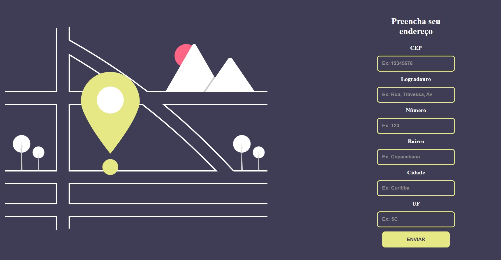

<h1 align=center>Projeto Pesquisa CEP</h1>

Desenvolvimento de uma página web que preenchendo o CEP completa automaticamente os outros dados, utilizando API ViaCEP. 
Foi utilizado JavaScript, HTML e CSS. 

